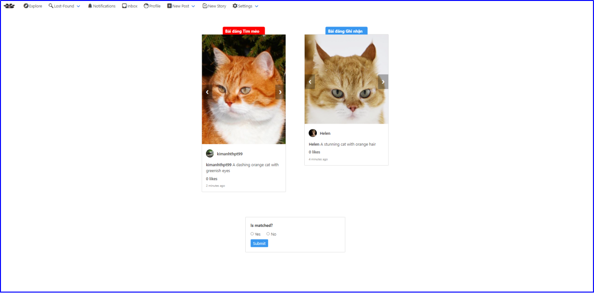

# A social networking sites for cat lovers
## 1. Social Network Site
   PetNet has almost all basic functions of a typical social network app: Newsfeed, Profile, Post, Like, Comment, Follow,  Real-time Chat, Real-time Notifications.

  

  

  

  

  

  

## 2. Function for recording memories of your cat
   Petnet allows user to create multiples cat accounts, each for one of their cat. A cat profile has basic information such as: name, description, face images, fullbody images. These 2 latter fields could be used in case of wanting to use Find Lost Cat feature in the future.
   

  

   Moreover, when user creates a post that associates with one or more cats, images and other information from that post will be automatically updated to those cats image album.
   

  

## 3. Find Lost Cat function
Petnet is envisioned to help cat owners reunite with their missing cats. Cats might have the tendency to wander off. If your cat might, unfornunately, go a little too far from home, or get stuck in some strange street corner, it will be helpful if someone come
   across your cat and post its images on the app as a Found Post. Now you also post a Lost Post on Petnet.
   

  

The rest is taken care by Petnet. Based on face recognition technology, it will find the best match it could by calculating embedding vectors for
   each post and compare them. Detail on how it work could be find here <a href="https://github.com/FreyMiggen/PROJECT_CAT_FACE_RECOGNITION">Cat Face Verification</a>.

   

  

   

  

All tasks that require heavy computation such as calculating embedding vectors, image processing are assigned to Celery via a message broker (Redis). 
This architecture helps Petnet deliver better user experience by not blocking the http request-response cycle.

