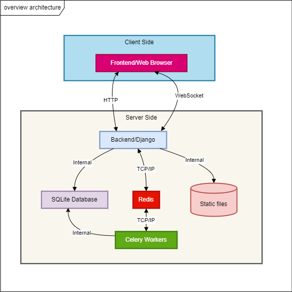
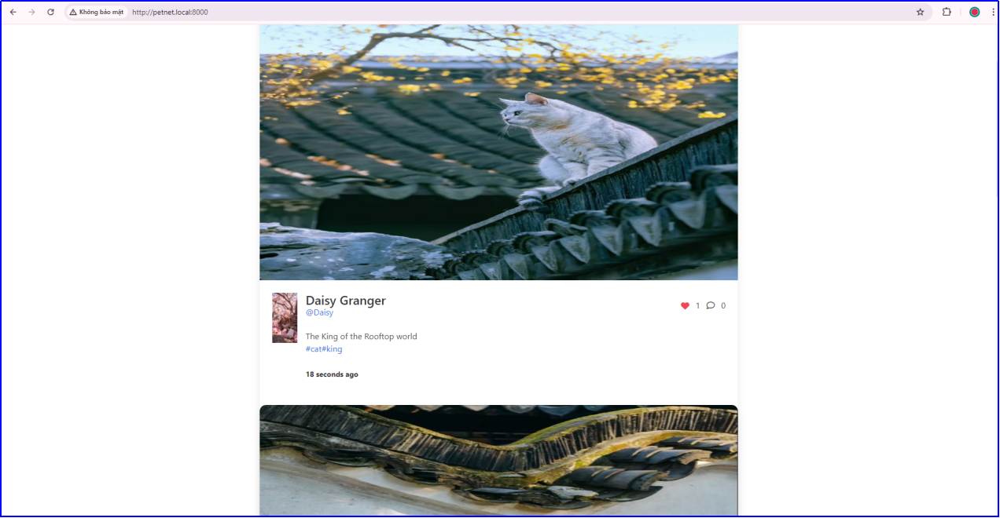
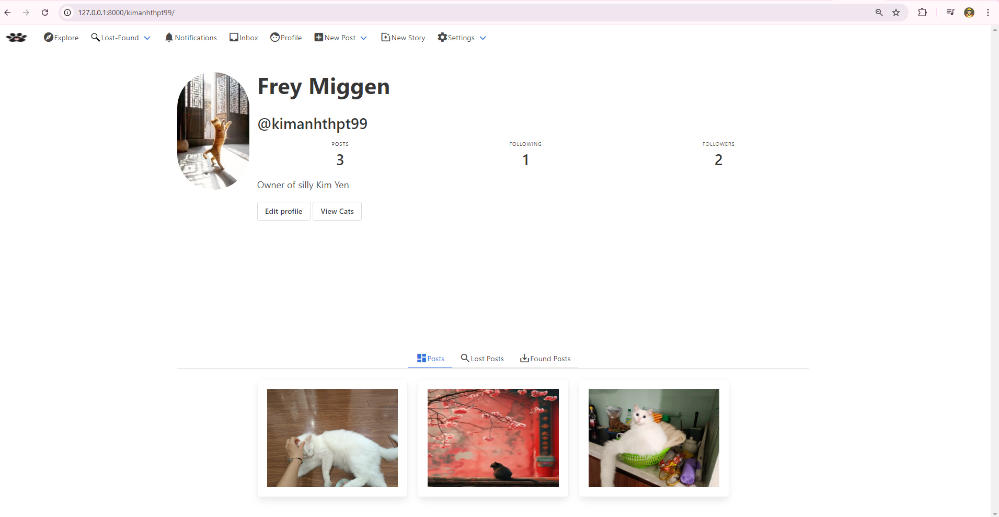
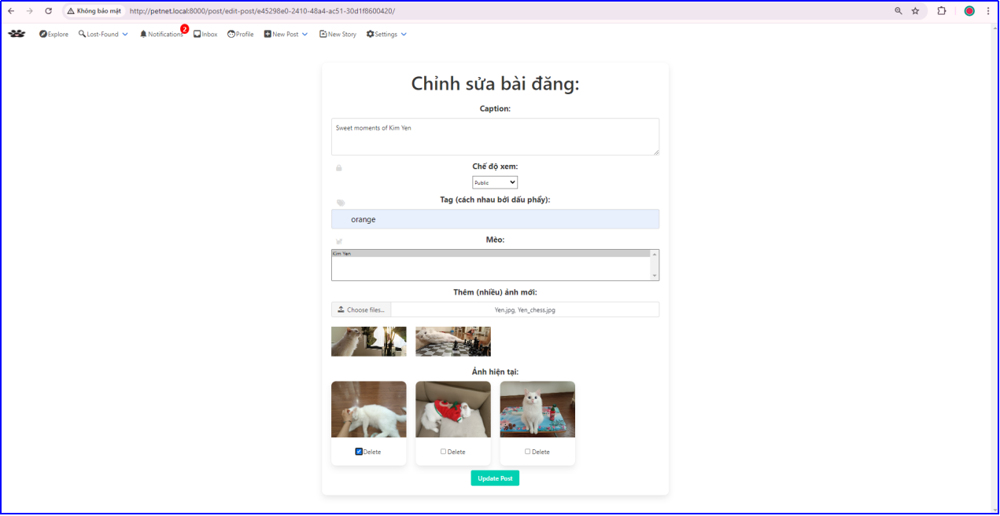
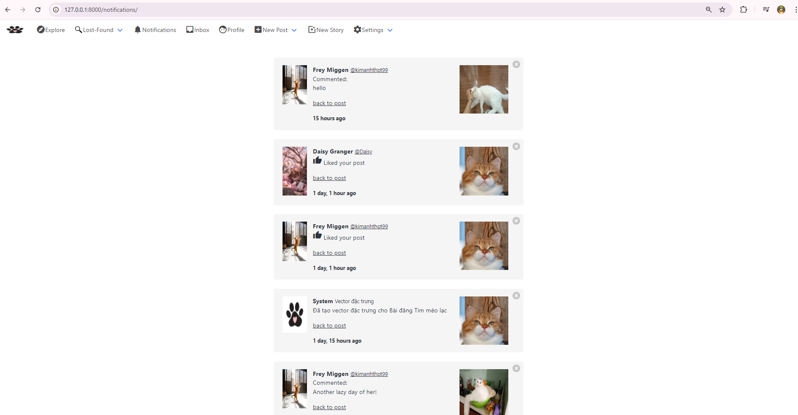
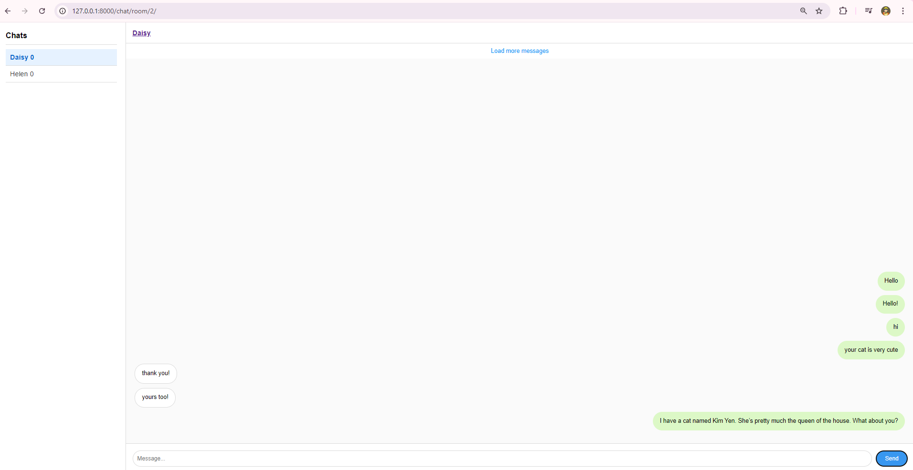
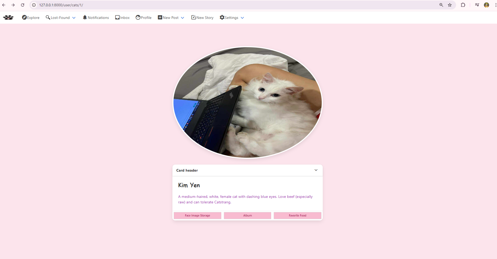
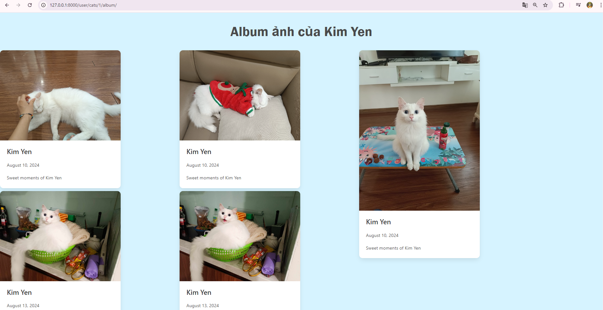
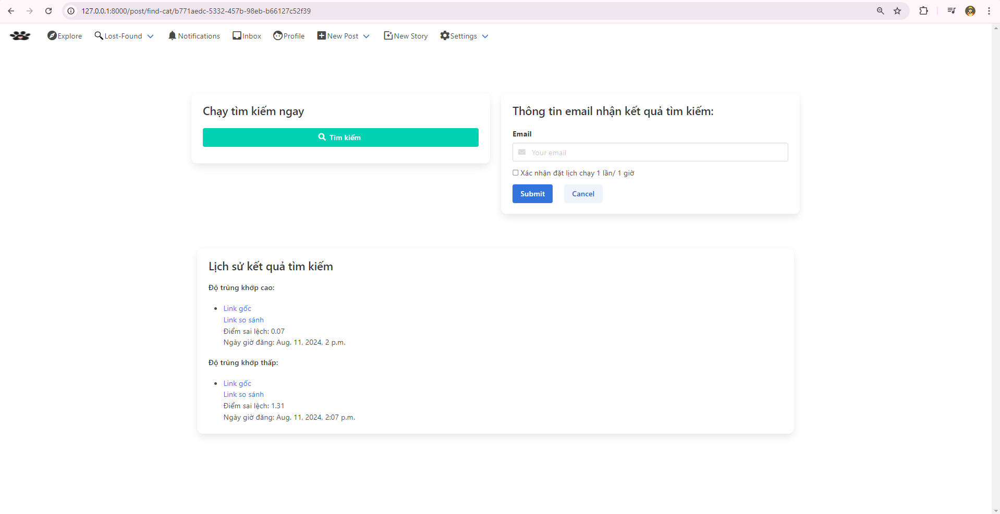

# A social networking sites for cat lovers
## A. How PetNet is designed
Petnet uses Django as backend, Celery as task scheduler and Redis as message broker.  
Overview architecture of Petnet

  

In this architecture, Celery workers are responsible for processing AI-related task in order not to block HTTP request - response cycle.
This is to due to the fact that such tasks usually take more time to finish. Also, Celery workers also process periodic tasks such as
sending emails for users about matching results.

Websocket is used in 2 functions of this app: Notification and Chat to provide users with a real-time experience.

Also, PetNet also utilizes Pagnigation technique to implement infinite-scrolling for Newsfeed page.

The aforementioned AI technology in PetNet is face recognition but developed and trained specially for recognizing cat faces. To attain that purpose, 
I build a deep convolutional neural network using Tensorflow. 
</b>

## B. What PetNet could do
## 1. Social Network Site
   PetNet has almost all basic functions of a typical social network app: Newsfeed, Profile, Post, Like, Comment, Follow,  Real-time Chat, Real-time Notifications.

  

  

  

  

  

  

## 2. Function for recording memories of your cat
   Petnet allows user to create multiples cat accounts, each for one of their cat. A cat profile has basic information such as: name, description, face images, fullbody images. These 2 latter fields could be used in case of wanting to use Find Lost Cat feature in the future.
   

  

   Moreover, when user creates a post that associates with one or more cats, images and other information from that post will be automatically updated to those cats image album.
   

  

## 3. Find Lost Cat function
Petnet is envisioned to help cat owners reunite with their missing cats. Cats might have the tendency to wander off. If your cat might, unfornunately, go a little too far from home, or get stuck in some strange street corner, it will be helpful if someone come
   across your cat and post its images on the app as a Found Post. Now you also post a Lost Post on Petnet.
   

  

The rest is taken care by PetNet. Based on face recognition technology, it will find the best match it could by calculating embedding vectors for
each post and compare them. Detail on how it work could be find here <a href="https://github.com/FreyMiggen/PROJECT_CAT_FACE_RECOGNITION">Cat Face Verification</a>.  

   

  

    Demo of how find cat function works:

   

    

All tasks that require heavy computation such as calculating embedding vectors, image processing are assigned to Celery via a message broker (Redis). 
This architecture helps Petnet deliver better user experience by not blocking the http request-response cycle.

